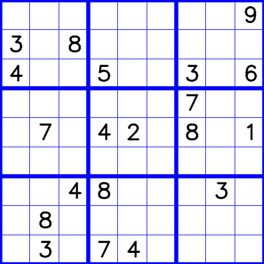
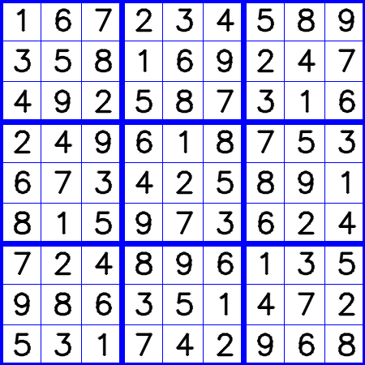

# Sudoku 練習

無聊練習，產生數獨及使用暴力搜索法解數獨問題

## Solving
```
simple question in WiKi
[[5 3 0 0 7 0 0 0 0]
 [6 0 0 1 9 5 0 0 0]
 [0 9 8 0 0 0 0 6 0]
 [8 0 0 0 6 0 0 0 3]
 [4 0 0 8 0 3 0 0 1]
 [7 0 0 0 2 0 0 0 6]
 [0 6 0 0 0 0 2 8 0]
 [0 0 0 4 1 9 0 0 5]
 [0 0 0 0 8 0 0 7 9]]
answer
[[5 3 4 6 7 8 9 1 2]
 [6 7 2 1 9 5 3 4 8]
 [1 9 8 3 4 2 5 6 7]
 [8 5 9 7 6 1 4 2 3]
 [4 2 6 8 5 3 7 9 1]
 [7 1 3 9 2 4 8 5 6]
 [9 6 1 5 3 7 2 8 4]
 [2 8 7 4 1 9 6 3 5]
 [3 4 5 2 8 6 1 7 9]]
using time =  2.4965624809265137

The hardest question in this world
[[8 0 0 0 0 0 0 0 0]
 [0 0 3 6 0 0 0 0 0]
 [0 7 0 0 9 0 2 0 0]
 [0 5 0 0 0 7 0 0 0]
 [0 0 0 0 4 5 7 0 0]
 [0 0 0 1 0 0 0 3 0]
 [0 0 1 0 0 0 0 6 8]
 [0 0 8 5 0 0 0 1 0]
 [0 9 0 0 0 0 4 0 0]]
answer
[[8 1 2 7 5 3 6 4 9]
 [9 4 3 6 8 2 1 7 5]
 [6 7 5 4 9 1 2 8 3]
 [1 5 4 2 3 7 8 9 6]
 [3 6 9 8 4 5 7 2 1]
 [2 8 7 1 6 9 5 3 4]
 [5 2 1 9 7 4 3 6 8]
 [4 3 8 5 2 6 9 1 7]
 [7 9 6 3 1 8 4 5 2]]
using time =  29.457792043685913

```

## Generation  
產生題目及解答
使用 config.ini 設定 mask_rate  



# TODO
1. 更快的解法
2. 檢查解的不唯一性
3. 增加穩定性
